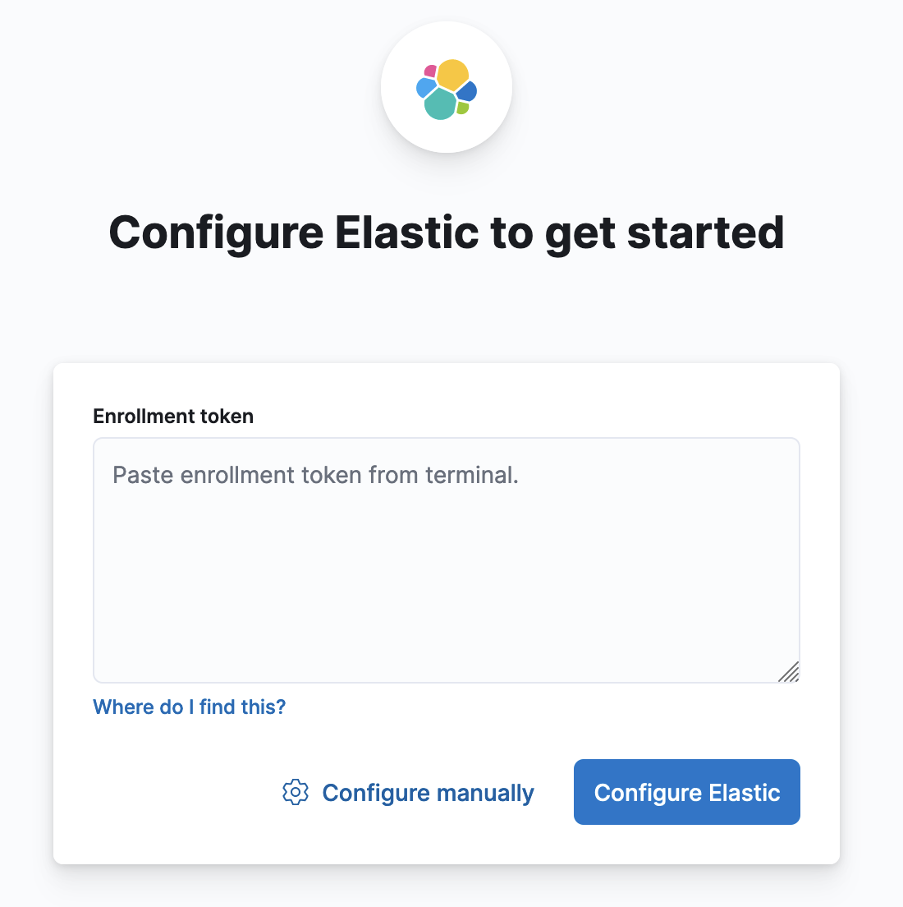
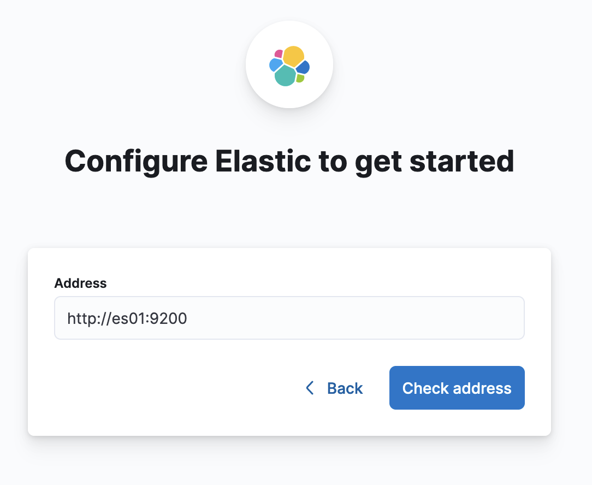
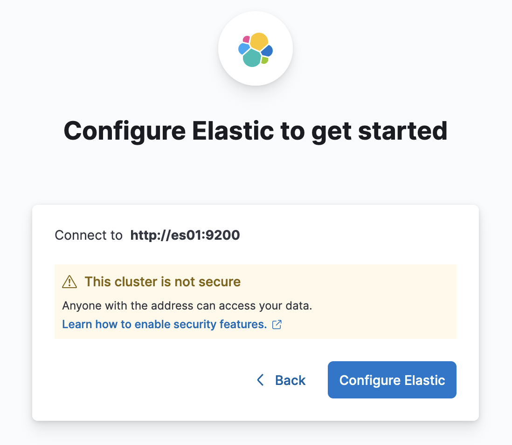
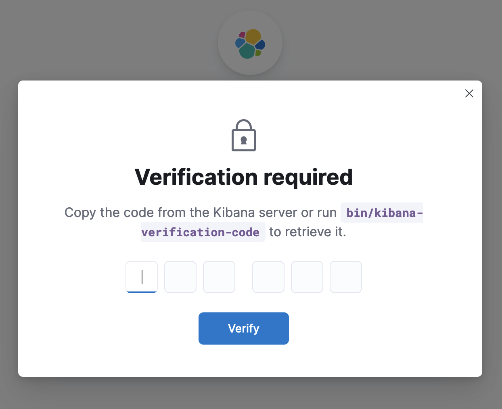

# Run Elasticsearch & Kibana in Docker

## Prerequisite

1. Install Docker.
2. Create a new docker network.

```sh
$ docker network create elastic
```

## Run Elasticsearch

Elasticsearch 本身預設會啟動 Security Feature，所以一定要走 HTTPS 的協議才可以。這邊教學是不要啟動 Security Featur。

> 如果要走正規的 HTTPS 以及如何部署，請參考[官方文件](https://www.elastic.co/guide/en/elasticsearch/reference/current/docker.html#run-kibana-docker)。

```sh
$ docker run --name es01 --net elastic -p 9200:9200 -it -m 1GB -e "xpack.security.enabled=false" -e "discovery.type=single-node" docker.elastic.co/elasticsearch/elasticsearch:8.13.4
```

- xpack.security.enabled: `false`, 不要啟動 security feature
- discovery.type: `single-node`, 只啟動單個節點

## Run Kibaba

```sh
$ docker run --name kib01 --net elastic -p 5601:5601 docker.elastic.co/kibana/kibana:8.13.4
```

Terminal 輸出如下所示:

```bash
Native global console methods have been overridden in production environment.
[2024-05-28T09:13:47.919+00:00][INFO ][root] Kibana is starting
[2024-05-28T09:13:47.950+00:00][INFO ][node] Kibana process configured with roles: [background_tasks, ui]
[2024-05-28T09:13:51.618+00:00][INFO ][plugins-service] The following plugins are disabled: "cloudChat,cloudExperiments,cloudFullStory,profilingDataAccess,profiling,securitySolutionServerless,serverless,serverlessObservability,serverlessSearch".
[2024-05-28T09:13:51.658+00:00][INFO ][http.server.Preboot] http server running at http://0.0.0.0:5601
[2024-05-28T09:13:51.711+00:00][INFO ][plugins-system.preboot] Setting up [1] plugins: [interactiveSetup]
[2024-05-28T09:13:51.718+00:00][INFO ][preboot] "interactiveSetup" plugin is holding setup: Validating Elasticsearch connection configuration…
[2024-05-28T09:13:51.731+00:00][INFO ][root] Holding setup until preboot stage is completed.


i Kibana has not been configured.

Go to http://0.0.0.0:5601/?code=033837 to get started.
```

此時你會發現有兩組 IP 位置:

- http://0.0.0.0:5601
- http://0.0.0.0:5601/?code=033837

後面的 code 是 `kibana-verification-code`，每次都不一樣，如果你打開 [http://0.0.0.0:5601](http://0.0.0.0:5601)，則會需要手動輸入，如果直接打開 [http://0.0.0.0:5601/?code={you-code}]() 則不需要再次輸入。

這邊讓我們打開 [http://0.0.0.0:5601](http://0.0.0.0:5601) 會看到下方畫面:



這邊如果是原本設定 `xpack.security.enabled:false`，走 HTTPS 的話，就要輸入啟動 Elasticsearch 給予的 `Enrollment token` 來進行驗證，但我們關閉了 security feature，所以要點擊下方的 `Configure manually` 來手動設定。


接著輸入: `http://<container-name>:9200`，例如: http://es01:9200，如下所示:




接著便會看到輸入 `kibana-verification-code` 的畫面，如下所示:



這邊就輸入剛剛 IP Adress 後面那串數字，忘記的話也可以進容器內取得，如下:

```sh
# 進入 Kibana容器內
$ docker exec -it kib01 bash
```

```sh
$ bin/kibana-verification-code
```

接著就可以看到 Kibana 的介面，如下所示:


